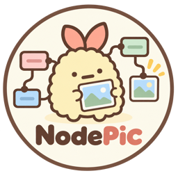
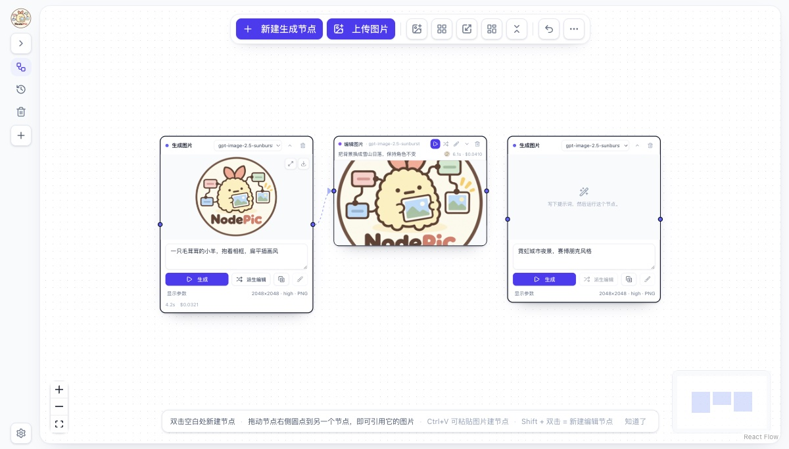

#  

**画布式 AI 图像工坊** · a canvas-based workshop for OpenAI's GPT Image models

在无限画布上生成、编辑、串联图片。**每个节点就是一次生成或编辑任务**，节点之间的连线表示「这张图是那张图的输入」——所以一条任务链就是一条图片的血缘关系。支持蒙版局部重绘、多图参考、历史画廊与费用估算。

<p align="center">
  
</p>

<p align="center">
  <a href="#-环境要求">环境要求</a> ·
  <a href="#-本地运行">本地运行</a> ·
  <a href="#-配置">配置</a> ·
  <a href="#-数据存在哪里">数据位置</a> ·
  <a href="#-上手三步出第一张图">上手</a> ·
  <a href="#-开发">开发</a> ·
  <a href="#-部署">部署</a> ·
  <a href="#-常见问题">常见问题</a>
</p>

> **关于模型**：默认 `gpt-image-2.5-flare`，可选 `gpt-image-2.5-sunburst` 与 `gpt-image-2`。三者都支持最高 4K 的任意边长与透明背景，`gpt-image-2.5-*` 额外提供 `xhigh` / `max` 质量档。已下线的 `gpt-image-1*` 不再出现在模型列表里，但用它们生成的旧图仍能在历史记录中查看。

## ✨ 功能

- **画布式工作流** —— 双击空白处新建节点；拖动节点右侧的圆点到另一个节点，即可把那张图作为它的输入。每个节点的参数、耗时、估算费用都留在节点上，改完参数可以直接重跑。
- **蒙版局部重绘** —— 画笔涂抹要改的区域（涂抹处即"可重绘区域"），橡皮擦掉多余部分；蒙版按**源图**保存，保存之后仍可继续涂抹或擦除。
- **多图参考** —— 一个编辑节点可以挂多张源图（默认上限 16，见 `NEXT_PUBLIC_MAX_EDIT_SOURCES`）。
- **历史画廊** —— 搜索提示词、按日期分组、查看费用明细、一键回到所在画布。
- **回收站** —— 删除的画布整块进回收站，可还原；也可批量清理不再被引用的孤儿图片。
- **导入 / 导出** —— 把画布导出为 JSON 备份或分享（含节点、提示词、参数与所引用的图片文件名；**不含图片文件本身，也不含蒙版**）。
- **中英双语界面** —— 自研轻量 i18n，英文原文即 key，加文案不需要改类型定义。
- **自备密钥** —— 不内置任何账号或密钥；密钥只存在你自己机器的服务端。

## 🖥 环境要求

| 项目 | 要求 | 说明 |
| --- | --- | --- |
| **Node.js** | **≥ 22，推荐 24** | 仓库里的 `.node-version` 写的是 `24`；`package.json` 的 `engines` 要求 `>=22`（Next.js 16 + React 19） |
| **npm** | ≥ 10（随 Node 一起安装） | 仓库带 `package-lock.json`，用 `npm install` 安装；pnpm / yarn 未验证 |
| **操作系统** | macOS / Linux / Windows | 应用本身跨平台；`scripts/*.sh` 是 macOS 专用的一键启动/停止脚本，其它系统忽略即可 |
| **浏览器** | Chrome / Edge / Safari 最新版 | 画布交互依赖 Pointer Events，建议用近两年的浏览器 |
| **网络** | 能访问你选择的图片接口 | 官方 `api.openai.com`，或任何兼容 OpenAI 的中转端点 |
| **API 密钥** | **必需**（自备） | OpenAI 官方密钥，或中转服务（如 [PackyAPI](https://cf.api.fan)）的密钥 |

> ⚠️ 使用 `gpt-image-*` 模型需要在 OpenAI 完成[组织验证](https://help.openai.com/en/articles/10910291-api-organization-verification)；用中转端点时以对方的要求为准。

## 🚀 本地运行

```bash
# 1. 获取代码
git clone https://github.com/HFUT-zhengjiahao/NodePic.git
cd NodePic

# 2. 安装依赖
npm install

# 3. 启动开发服务器
npm run dev
#    → http://localhost:3000

# 4.（可选）生产模式
npm run build && npm start
```

**填入你的 API 密钥**（二选一，推荐第一种）：

1. **在应用里填（推荐）** —— 打开 <http://localhost:3000>，点左下角 **设置 → API 接口**，填「API 接口地址」与「API 密钥」后点「应用」。
   密钥保存在服务端的 `.playground-settings.json`（已被 `.gitignore` 忽略，不会提交，也**不会回传到浏览器**，界面上只显示末四位）。
2. **用环境变量** —— 复制模板后填入：

   ```bash
   cp .env.example .env.local
   ```

   ```dotenv
   OPENAI_API_KEY=sk-...
   OPENAI_API_BASE_URL=https://cf.api.fan/v1   # 可选：用中转端点代替官方 api.openai.com
   ```

设置页里的值**优先于**环境变量；两者都没有时，生成会返回 `No API key configured.` 并提示去哪里填。改动即时生效，不需要重启。

## ⚙️ 配置

### 应用内设置（左下角「设置」）

| 设置项 | 作用 | 默认 |
| --- | --- | --- |
| 图片保存位置 | 图片写到服务端的哪个目录（相对项目根目录或绝对路径）；可勾选把已有图片一起搬过去 | `generated-images` |
| 删除的图片保留多久（天） | 回收站里的图片超过这个天数会被清理 | `30` |
| API 接口地址 / API 密钥 | 见上一节；留空则用环境变量或官方端点 | 空 |
| 访问密码 | 仅当服务端设置了 `APP_PASSWORD` 时才需要输入 | — |

### 环境变量（全部可选）

| 变量 | 默认 | 说明 |
| --- | --- | --- |
| `OPENAI_API_KEY` | — | 图片接口密钥（设置页留空时使用） |
| `OPENAI_API_BASE_URL` | 官方 | 兼容 OpenAI 的接口地址，例如 `https://cf.api.fan/v1` |
| `APP_PASSWORD` | 未设置 | 设置后所有**写操作**需要密码，界面会弹密码框；暴露到局域网/公网时请务必设置 |
| `NEXT_PUBLIC_IMAGE_STORAGE_MODE` | `fs` | `fs` = 图片写服务器磁盘；`indexeddb` = 图片存浏览器（serverless 部署用） |
| `NEXT_PUBLIC_MAX_EDIT_SOURCES` | `16` | 一个编辑节点最多挂几张源图（上限 16） |
| `IMAGE_UPLOAD_MAX_MB` | `25` | 单张上传图片大小上限 |
| `IMAGE_DOWNLOAD_MAX_MB` | `25` | 从上游下载生成结果的大小上限 |
| `IMAGE_PROVIDER_TIMEOUT_MS` | `180000` | 单次生成请求超时（毫秒） |
| `IMAGE_CLEANUP_MIN_AGE_MINUTES` | `10` | 清理任务只删除超过这个时长的临时文件 |
| `PORT` | `3000` | 服务端口，例如 `PORT=3210 npm run dev` |

## 🗂 数据存在哪里

| 数据 | 位置 | 说明 |
| --- | --- | --- |
| **图片** | 服务端 `generated-images/`（可在设置页改） | 首次生成时目录会自动创建；克隆下来是空的 |
| **画布 / 历史 / 回收站 / 界面偏好** | 浏览器 `localStorage`（`gptImageCanvas*`、`openaiImageHistory`） | **按浏览器、按域名隔离**——换浏览器或清缓存就会看不到，重要画布请用「导出画布」留一份 |
| **蒙版** | 浏览器 IndexedDB（`masksV2`，键为 `画布id:源图文件名`） | 跟随源图；换浏览器同样会丢 |
| **API 密钥与保存目录** | 服务端 `.playground-settings.json` | 已被 `.gitignore` 忽略，不会进仓库 |

所以备份一套完整工作区 = **图片目录** + **每块画布的导出 JSON**（蒙版需要重新涂，导出文件不含蒙版）。

## 🧭 上手：三步出第一张图

1. 双击画布空白处 → 出现一个**生成节点** → 写提示词 → 点「生成」。
2. 点节点上的「**派生编辑**」，或者从节点右侧圆点拖一条线到另一个节点 → 得到一个带源图的**编辑节点**。
3. 编辑节点里点「**蒙版**」→ 涂掉想改的区域 → 保存 → 生成，只有涂过的区域会被重绘。

其它快捷操作：`Shift + 双击` 新建编辑节点、`Ctrl/Cmd + V` 把剪贴板里的图片直接建成节点、节点右上角可折叠成紧凑卡片。

## 🛠 开发

```bash
npm run dev          # 开发服务器（Turbopack）
npm run build        # 生产构建
npm start            # 启动生产构建
npm run check        # 提交前跑这个：lint + 类型 + 单测 + i18n 校验
npm test             # Vitest 单测（npm run test:watch 为监听模式）
npm run typecheck    # tsc --noEmit（用随仓库安装的 TypeScript 7 预览版）
npm run lint         # ESLint
npm run i18n:check   # 校验所有用到的文案都有中文翻译
npm run format       # Prettier
```

目录结构：

```
src/app/                  Next.js App Router：页面 + API 路由（生成、上传、图片、设置…）
src/components/canvas/    画布本体：节点卡片、连线、侧栏、蒙版对话框、历史画廊
src/components/ui/        基础 UI 组件
src/lib/                  画布数据模型、localStorage/IndexedDB 存储、成本估算、i18n
src/lib/i18n/zh/          中文文案（英文原文为 key；新增文案要在这里补一条）
scripts/                  一键启动脚本（macOS）、i18n 校验
public/                   徽标与字标
```

## ▲ 部署

- **自托管（推荐）** —— `npm run build && npm start`。这是一个**本地优先的单用户应用**，没有账号体系；要暴露到局域网或公网，请设置 `APP_PASSWORD`，并把图片目录指到大容量磁盘。
- **Vercel 等 serverless** —— 函数的文件系统是只读的，请设置 `NEXT_PUBLIC_IMAGE_STORAGE_MODE=indexeddb`，此时图片保存在浏览器里，服务端不落盘（历史记录与画布本来就在浏览器）。

## ❓ 常见问题

**克隆下来没有 `generated-images/` 目录？** 正常，首次生成时会自动创建，也可以在设置页改成别的目录。

**提示 `No API key configured.`** 打开 设置 → API 接口 填入密钥；或检查 `.env.local` 里的 `OPENAI_API_KEY`。

**生成的图不显示了 / 历史里是空框？** 图片文件可能被移走或清理了。换保存目录时请勾选「把已有图片一起移动过去」。

**端口被占用** —— `PORT=3210 npm run dev`。

**换电脑 / 换浏览器后画布空了** —— 画布与历史存在浏览器本地，图片在服务器。用「导出画布」把结构带走，并把图片目录一起复制过去。

**会花钱吗？** 每次生成按接口方价格计费，应用只做**估算**（价格表在 `src/lib/cost-utils.ts`），不会自动重试、不会在后台偷偷请求。

**能用别的模型或中转吗？** 任何兼容 OpenAI `images` 接口的端点都行，填在设置页的「API 接口地址」即可。

## 🇬🇧 English quick start

NodePic is a canvas-based workshop for OpenAI's GPT Image models. Every node is one generation or
edit task, and the wires between nodes are the picture lineage.

**Requirements:** Node.js **≥ 22** (24 recommended, see `.node-version`), npm ≥ 10, a modern
browser, and **your own API key** (OpenAI, or any OpenAI-compatible relay such as PackyAPI).

```bash
git clone https://github.com/HFUT-zhengjiahao/NodePic.git
cd NodePic
npm install
npm run dev                 # -> http://localhost:3000
```

Then open the app, click **Settings → API** in the bottom-left corner, paste your **API base URL**
and **API key**, and press Apply. The key is stored server-side in `.playground-settings.json`
(gitignored, never sent back to the browser). Prefer environment variables? `cp .env.example
.env.local` and fill in `OPENAI_API_KEY` / `OPENAI_API_BASE_URL` — the settings panel wins when both
are present.

Pictures are written to `generated-images/` on the server (a fresh clone starts empty); canvases,
history and masks live in your browser's localStorage/IndexedDB, so export a canvas if you want to
move it. Production: `npm run build && npm start`. Run `npm run check` before committing.

## 🙏 致谢

本项目是 [alasano/gpt-image-playground](https://github.com/alasano/gpt-image-playground) 的定制分支：在原项目之上做了画布化改造（节点工作流 + 血缘连线）、中文界面、可反复编辑的蒙版、按源图保存的蒙版、画布回收站与费用估算等。

## 📄 许可

[MIT](./LICENSE) · 上游版权归原作者所有，详见 [LICENSE](./LICENSE)。
